# Windows-basic-commands-batchscript
Ex08-Windows-basic-commands-batchscript

# AIM:
To execute Windows basic commands and batch scripting

# DESIGN STEPS:

### Step 1:

Navigate to any Windows environment installed on the system or installed inside a virtual environment like virtual box/vmware 

### Step 2:

Write the Windows commands / batch file
Save each script in a file with a .bat extension.
Ensure you have the necessary permissions to perform the operations.
Adapt paths as needed based on your system configuration.
### Step 3:

Execute the necessary commands/batch file for the desired output. 

# WINDOWS COMMANDS:
## Exercise 1: Basic Directory and File Operations
Create a directory named "my-folder"

## COMMAND AND OUTPUT
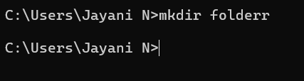

Remove the directory "my-folder"

## COMMAND AND OUTPUT
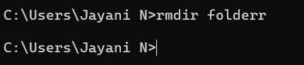

Create the file Rose.txt

## COMMAND AND OUTPUT

Create the file hello.txt using echo and redirection

## COMMAND AND OUTPUT

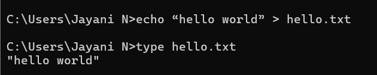

Copy the file hello.txt into the file hello1.txt

## COMMAND AND OUTPUT

Remove the file hello1.txt

## COMMAND AND OUTPUT

List out the file hello1.txt in the current directory

## COMMAND AND OUTPUT

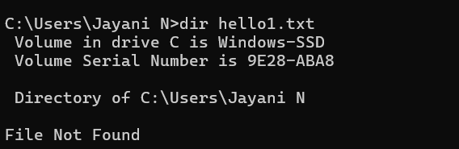

List out all the associated file extensions

## COMMAND AND OUTPUT

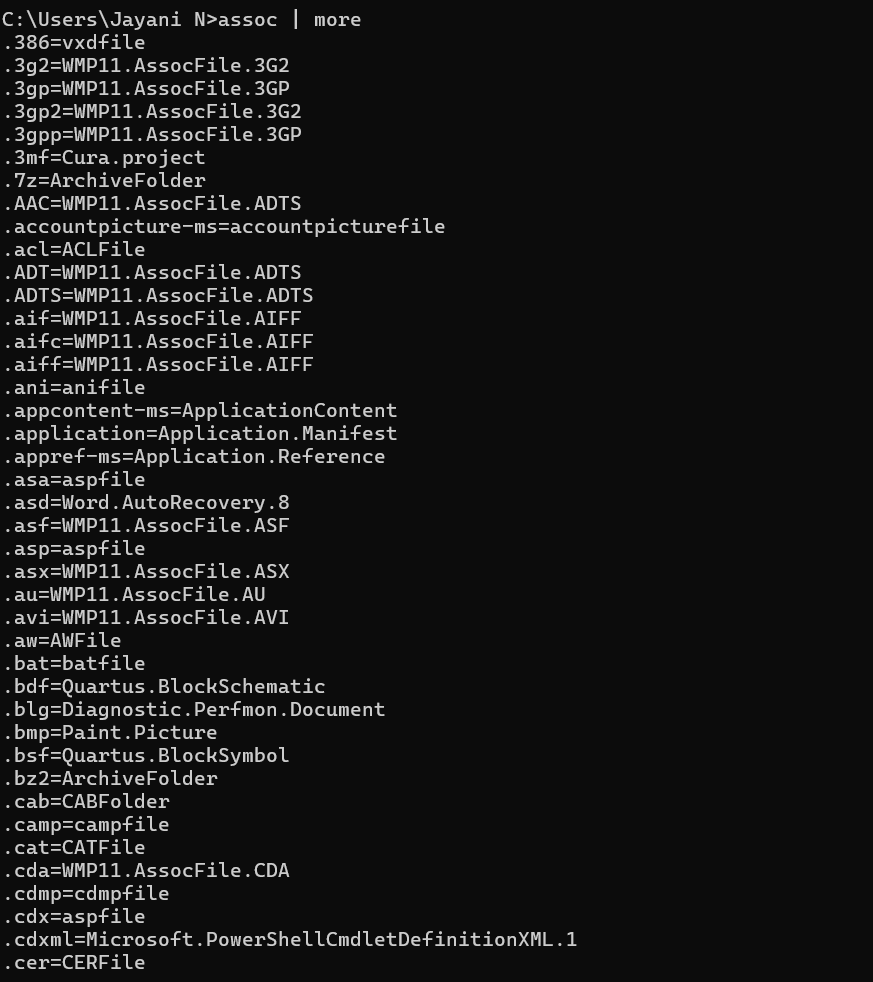

Compare the file hello.txt and rose.txt

## COMMAND AND OUTPUT

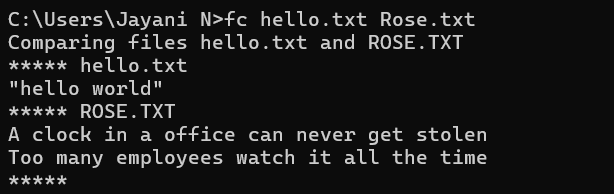

## Exercise 2: Advanced Batch Scripting

1.Create a batch file named on the desktop. The batch file need to have a variable assigned with a desired name for ex. name="John" and display as "Hello, John".

## PROGRAM

    @echo off
    set name=John
    echo Hello, %name%
    pause

## OUTPUT

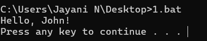

2.Create a batch file on the desktop that checks whether a user-input number is odd or not. The script should: Prompt the user to enter a number. Calculate the remainder when the number is divided by 2. Display whether the number is odd or not. Ask the user if they want to check another number. Repeat the process if the user enters Y, and exit with a thank-you message if the user enters N. Handle invalid inputs for the continuation prompt (Y/N) gracefully

## PROGRAM

    @echo off
    :loop
    set /p num=Enter a number: 
    set /a rem=%num% %% 2

    if %rem%==0 (
        echo %num% is Even
    ) else (
        echo %num% is Odd
    )

    :ask
    set /p ans=Do you want to check another number? (Y/N): 
    if /I "%ans%"=="Y" goto loop
    if /I "%ans%"=="N" goto end
    echo Invalid input. Please enter Y or N.
    goto ask

    :end
    echo Thank you!
    pause

## OUTPUT

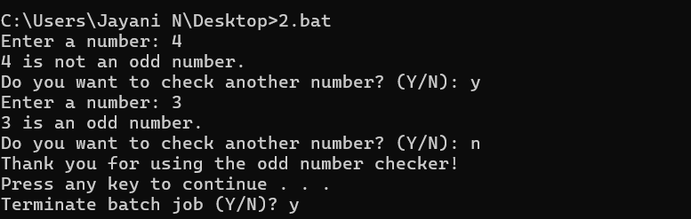

3.Write a batch file that uses a FOR loop to iterate over a sequence of numbers (1 to 5) and displays each number with the label Number:. The output should pause at the end

## PROGRAM

    @echo off
    for /L %%i in (1,1,5) do (
        echo Number: %%i
    )
    pause

## OUTPUT

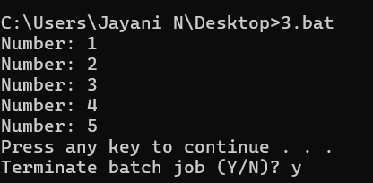

4.Write a batch script to check whether a file named sample.txt exists in the current directory. If the file exists, display the message sample.txt exists. Otherwise, display sample.txt does not exist. Pause the script at the end to view the result

## PROGRAM

    @echo off
    if exist sample.txt (
        echo sample.txt exists.
    ) else (
        echo sample.txt does not exist.
    )
    pause

## OUTPUT

5.Write a batch script that displays a simple menu with three options: Say Hello – Displays the message Hello, World! Create a File – Creates a file named newfile.txt with the content This is a new file Exit – Exits the script with a goodbye message The script should repeatedly display the menu until the user chooses to exit. Use goto statements to handle menu navigation.

## PROGRAM

    @echo off
    :menu
    cls
    echo 1. Say Hello
    echo 2. Create a File
    echo 3. Exit
    set /p choice=Choose an option (1-3): 

    if "%choice%"=="1" goto hello
    if "%choice%"=="2" goto create
    if "%choice%"=="3" goto exit
    echo Invalid choice.
    pause
    goto menu

    :hello
    echo Hello, World!
    pause
    goto menu

    :create
    echo This is a new file > newfile.txt
    echo File newfile.txt created.
    pause
    goto menu

    :exit
    echo Goodbye!
    pause
    exit

## OUTPUT 

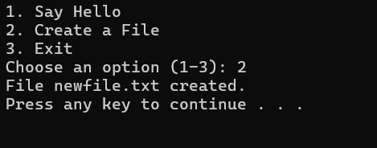
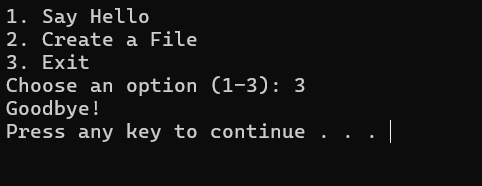

# RESULT:
The commands/batch files are executed successfully.

